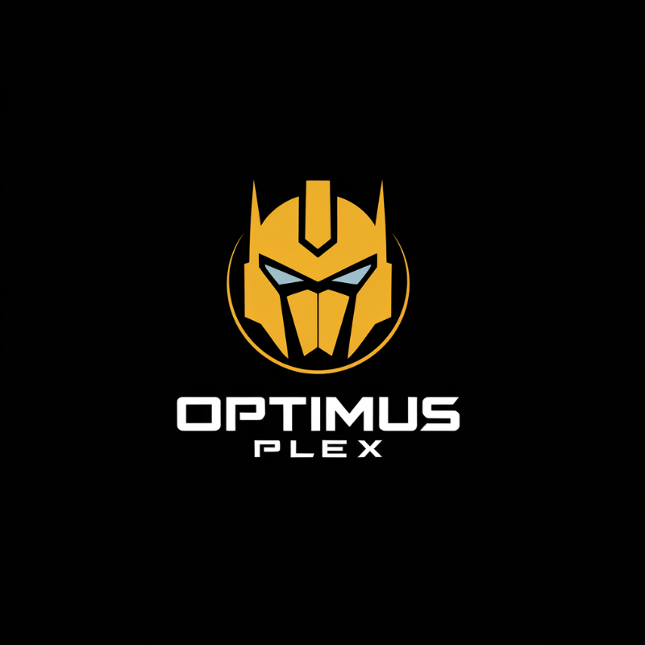

# Optimus Plex


Optimus Plex is a Python-based file conversion tool that leverages ffmpeg to convert files from one format to another.

## Features

- Crawl through a specified directory to find files of a given input format
- Convert files to a specified output format using ffmpeg
- Logging of successful conversions and errors

## Requirements

- Python 3.6+
- ffmpeg-python
- (Other dependencies should be listed here)

## Installation

1. Clone the repository:
```bash
   git clone https://github.com/yourusername/optimus-plex.git
   cd optimus-plex
   ```

2. Install the required packages:
```bash	
poetry install
```

3. Ensure ffmpeg is installed on your system.

## Docker Instructions
[Link to the Docker Image](https://hub.docker.com/r/pablominue/optimus-plex)
To run Optimus Plex using Docker, follow these steps:

1.
Build the Docker image:
```bash
docker build -t optimus-plex .
```
2.
Run the Docker container:
```bash
docker run -v /path/to/your/files:/app/files optimus-plex

```
Replace /path/to/your/files with the path to the directory containing your input files. The -v flag mounts this directory into the container.


## Usage

Here's a basic example of how to use the Converter class:

```python
from src.converter.converter import Converter

# Initialize the converter with the desired output format
converter = Converter(output_format="mp4")

# Run the conversion
converter.run(input_format="avi", base_path="/path/to/your/files")

```

# Project Structure

- src/converter/converter.py: Contains the main Converter class
- src/crowler.py: Contains the Crowler class for file discovery
- src/utils.py: Contains utility functions and classes like PabLog


# Contributing
Contributions are welcome! Please feel free to submit a Pull Request.

# Acknowledgements
This project uses the following open-source packages:
ffmpeg-python


# Contact
Project Link: https://github.com/pablominue/optimus-plex